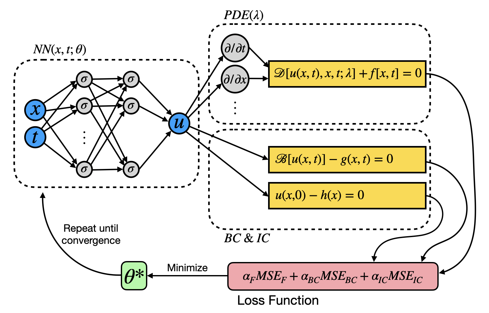
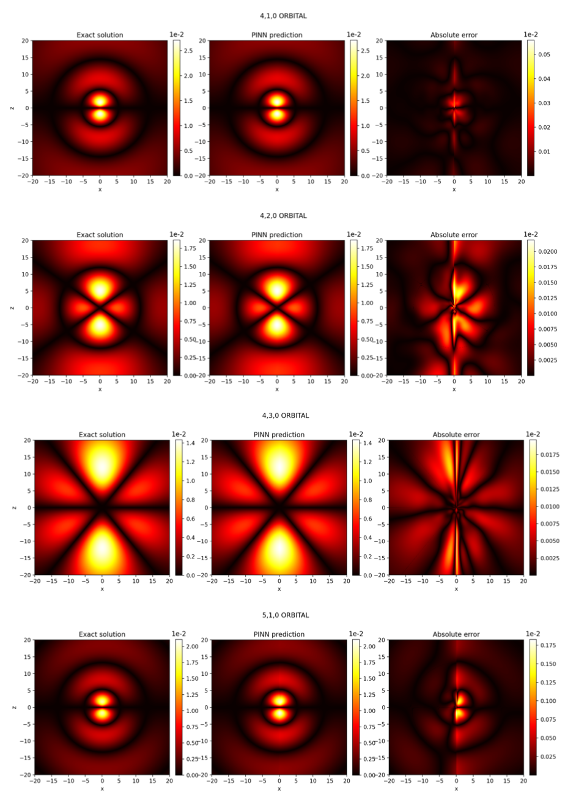

# PINNs-Experiments

[](https://opensource.org/licenses/MIT)

 &#8594; 

Using physics-informed neural networks (**PINNs**) for solving atomic time-dependent Schrödinger equation (**TDSE**) in perturbative regime. Various experiments are available within the project framework:
* Hydrogen orbitals (solving unperturbed atomic time-independent Schrödinger equation (**TISE**))
* Hydrogen atom in a DC Stark setting
* Unperturbed hydrogen orbital evolution (solving unperturbed atomic TDSE)
* One-level atom in an AC Stark setting

## 1) Setup

Create and activate the `conda` environment:

```console
conda env create -f conda.yml
conda activate pinns-experiments
```

## 2) Styling

Enforce styling with `black`:

```console
python -m black src
```

## 3) Getting Started

Experiment scripts are located in `examples` directory. All experiment parameters can be defined by a config (`.yaml`) file in `examples/experiment_configs`, such as: 
```yaml
experiment_params:
  quantum_numbers:
    n: 2
    l: 1
    m: 0
  radial_extent: 30

network_params:
  backbone: "ResNet"
  input_size: 3
  output_size: 2
  num_neurons: 50
  num_blocks: 3

  num_domain: 10000
  num_boundary: 2000

  lrs: [1e-3, 1e-5, 1e-6, 1e-7]
  optimizers: ["adam", "adam", "adam", "adam"]
  epochs: [50000, 50000, 5000, 5000]
  loss_weights: [1,1,1,1,1,1,10,10,1,1,1,1]
  strict_boundary: True # loss weights and strict boundary must be compatible!

prior_params:

results_path: "Enter the path of your results folder here"
```

### Run an example experiment

In order to run the example experiment for the hydrogen orbitals, define the path of the results directory in `examples/experiment_configs/TISE_hydrogen_without_decomposition/example_resnet.yaml`, e.g.:
```yaml
results_path: "examples/results/TISE_hydrogen/"
```

Then, you can run the training script:
```console
python TISE_hydrogen_without_decomposition --config_path ./experiment_configs/TISE_hydrogen_without_decomposition/example_resnet.yaml
```

The model checkpoints will be saved in the results directory given in the config file.

### Evaluate your experiments

In order to evaluate the accuracy of your experiments and create beautiful plots, use the `evaluation.py` script in `src/pinnse/`. Fill the following lines in the `main` function:
```python
script = "TISE_hydrogen_without_decomposition"
save_pth = "model ckpt path"
config_path = "config file path"
```
And go ahead and evaluate your experiments:
```console
python evaluation.py
```
